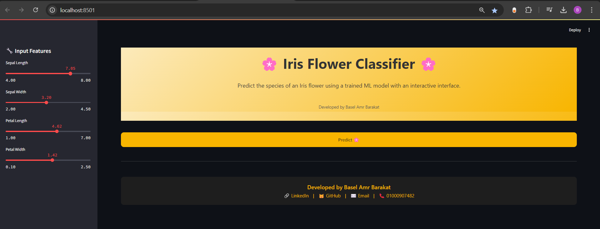
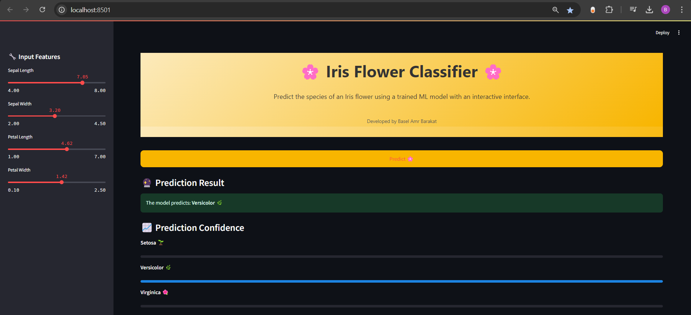
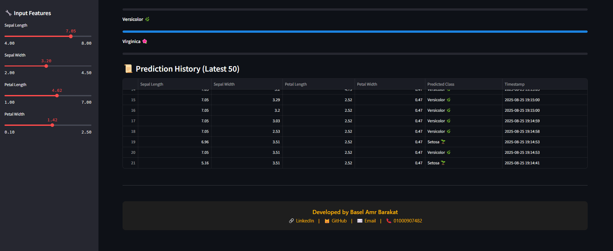

# 🌸 Iris Flower Classifier

A beautiful, interactive web application for predicting the species of Iris flowers using a trained machine learning model. Built with Streamlit, scikit-learn, and SQLite, this app allows users to input flower features, predict the species, visualize prediction probabilities, and maintain a prediction history.

---

# 🚀 Features
*   Interactive Input: Use sliders to input sepal and petal measurements.
*   Predict on Demand: Predictions are triggered only when the user presses the “Predict 🌸” button.
*   Feature Scaling: Inputs are automatically scaled using a pre-trained scaler.
*   Prediction Display: Shows predicted Iris species with fun icons.
*   Probability Visualization: Displays prediction confidence using interactive progress bars.
*   Prediction History: Stores the latest predictions in an SQLite database and displays them in-app.
*   Beautiful UI: Custom HTML homepage, dark-themed footer, and polished layout.
*   Portable: Runs locally with a single command.

---
# 📸 Screenshots & Demo
### **1. Home Page**


### **2. Predict Page**


### **3. History Page**


### **4. Demo Video**
[](app/assets/demo_video.mp4)


---
# 📂 Project Structure
```
├─ run_app.bat                     # Batch file to run the Streamlit app
├─ models/
│  ├─ scaler.pkl                  # Pre-trained scaler
│  ├─ KNN_best_Iris.pkl           # Trained KNN model
│  └─ iris_history.db             # SQLite database for prediction history
├─ app/
│  ├─ streamlit_app.py            # Main Streamlit app
│  ├─ utils/
│  │  ├─ preprocessing.py        # Data preprocessing functions
│  │  ├─ model_utils.py          # Model loading and saving utilities
│  │  └─ evaluation.py           # Model evaluation functions
│  ├─ templates/
│  │  └─ home.html               # Custom HTML homepage
│  ├─ static/
│  │  └─ style.css               # Custom CSS for the app
│  └─ assets/
│     ├─ demo_video.mp4           # Demo video of the app
│     ├─ History_Page.png         # Screenshot of prediction history
│     ├─ home_page.png            # Screenshot of home page
│     └─ Predict_page.png         # Screenshot of prediction page

```
---

# 💻 Installation & Running
1. Clone the repository
```bash
git clone <https://github.com/Basel-Amr/codveda-ml-internship-tasks.git>
cd Iris_data_streamlit_appr>
```
2. Install dependencies
```bash
pip install -r requirements.txt
```
3. Run the app
```bash
Double-click run_app.bat or run via command line:
streamlit run app/streamlit_app.py

```
4. Open in browser
The app will automatically open in your default browser, or go to:
```bash
http://localhost:8501
```
